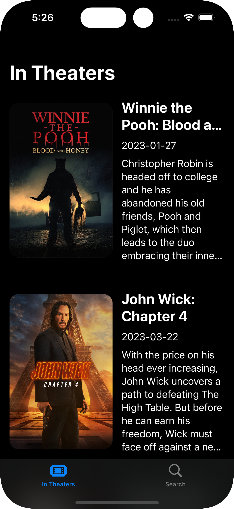
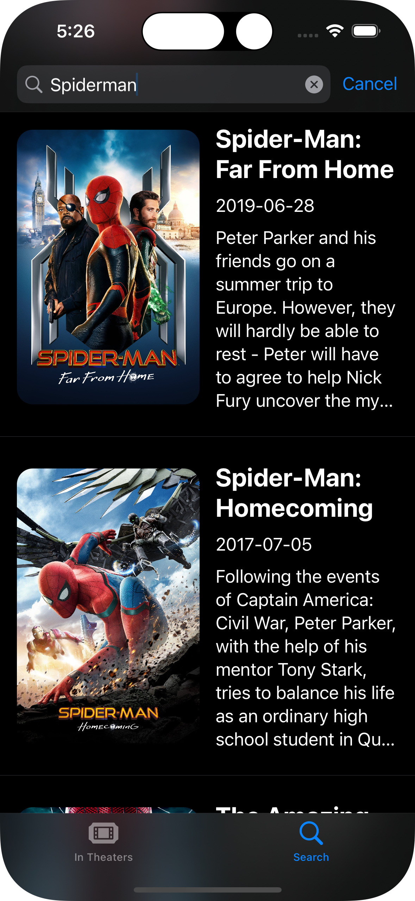

<!-- PROJECT LOGO -->
 

  

  <h3 align="center">Movieflix</h3>

  

    Explore and take a look at TMDB movies database
     
    <a href=""><strong>Explore the docs</strong></a>
     
     
    <a href="#demo">View Demo</a>
    ·
    <a href="https://github.com/spicyhotnoodles/Movieflix">Report Bug</a>
    ·
    <a href="https://github.com/spicyhotnoodles/Movieflix">Request Feature</a>
  

# Movieflix
## What's Movieflix?
Movieflix is a personal project done for my study goals @ the Apple Developer Academy. The project was about developing an app using both the SwiftUI and UIKit framework to practise in app developing and into study how UIKit UIs are made. The app is a simple movies browser, you can search for any movie and look at the plot and its poster. Also it shows the movies that are currently in cinemas. This was possibile thanks to the TMBD API which hosts all the data of the movies.
## Is the app working?
Yes you can actually build the app on your personal devices with XCode and try it for yourself. Mind that the app could crash sometimes depending on what you write in the search bar. This is because TMDB supports **really a lot** of languages (even some that I didn't even think they could exist) and I could not insert all of them because of time. I would be so happy if some of you could test it and tell me if they experience crash issues.
## What about UIKit?
Right now the app is partially implemented in UIKit because I did not have time to do that but I will keep the repo updated in case you're interested.
## So that's it?
In reality no. The initial idea was way more "original"; since I'm a really lazy person, and I do not want to bother into searching on the web or in `<<insert famous streaming service's name>>` catalogue, I wanted to make an app which can suggest you random movies (available on the most popular platforms) to watch, like shuffle, maybe based on your personal tastes. Since I had really little time to do that, I couldn't make it, but I'll try in the future to do so.
## Screenshots

    
    
  </a>

## Demo

  
  </a>

